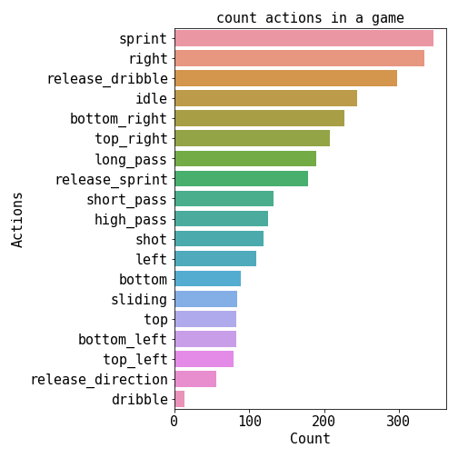
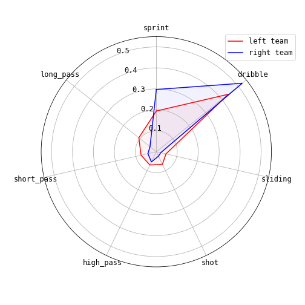
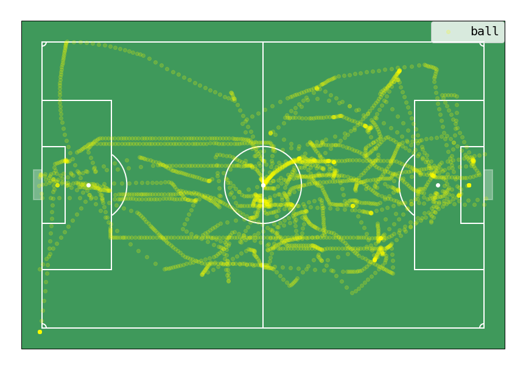
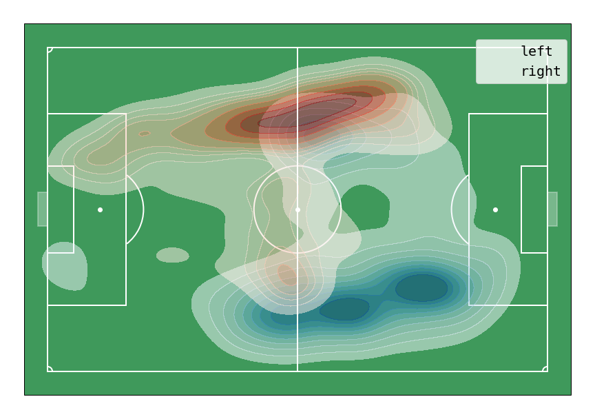

## 概要
[Google Research Football](https://github.com/google-research/football)環境を使って対戦や分析を行うレポジトリ

## 分析例

- 行動回数
<div align="center"></div>

- 主要行動の比較
<div align="center"></div>

- ボールのトラッキング
<div align="center"></div>

- 選手位置のマッピング
<div align="center"></div>


## 使い方
clone後Dockerfileのあるにディレクトリに移動してdockerをbuild
```sh
$ docker-compose up --build
```
buildが終わると出力にjupyter labのリンクが出てくるのでそこからjupyter labを起動する  


## ディレクトリ構造
- agent  
使用するagentの.pyファイルを置いているフォルダ  
agentを追加したい場合はここにファイルを置く  
agentのファイルの作成方法は以下を参考  
https://www.kaggle.com/piotrstanczyk/gfootball-template-bot 

- output  
分析結果の画像等を保存するフォルダ

- analysis.ipynb  
データ分析用のnotebook

